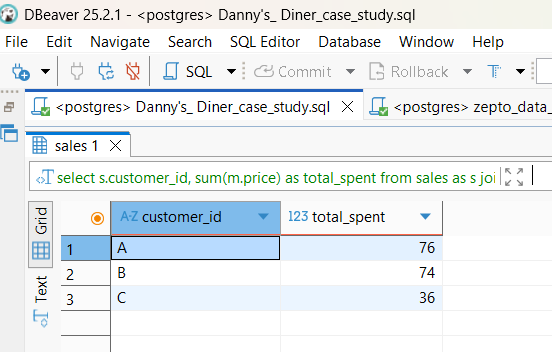
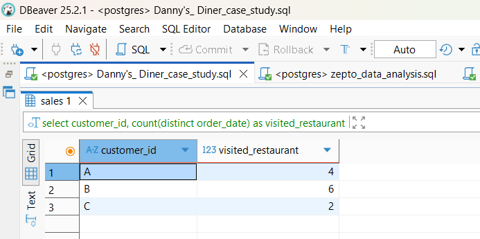
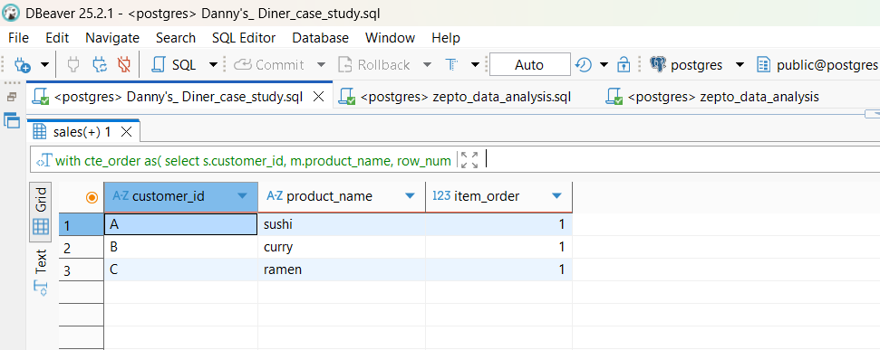
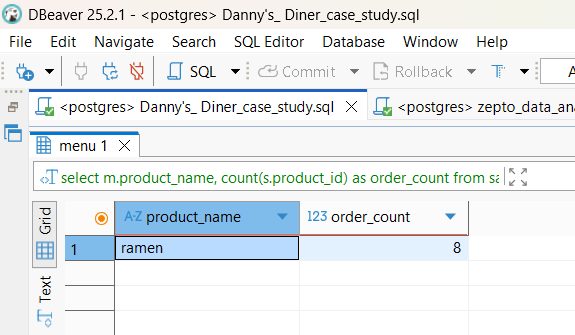
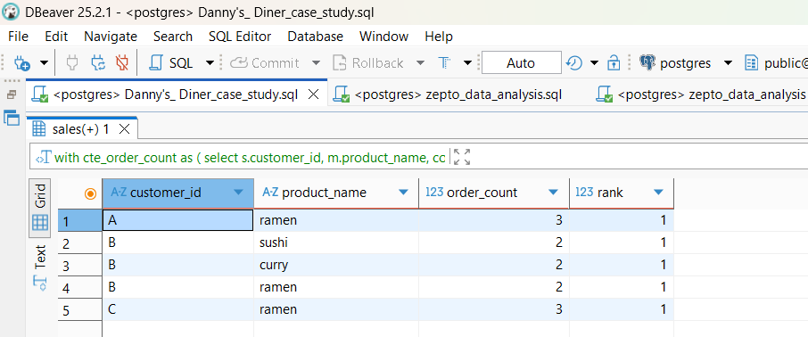
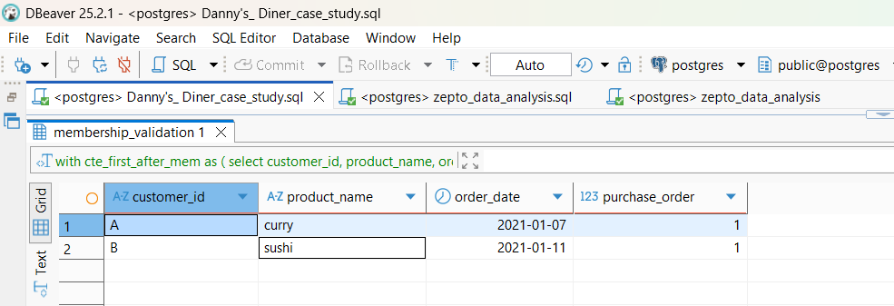
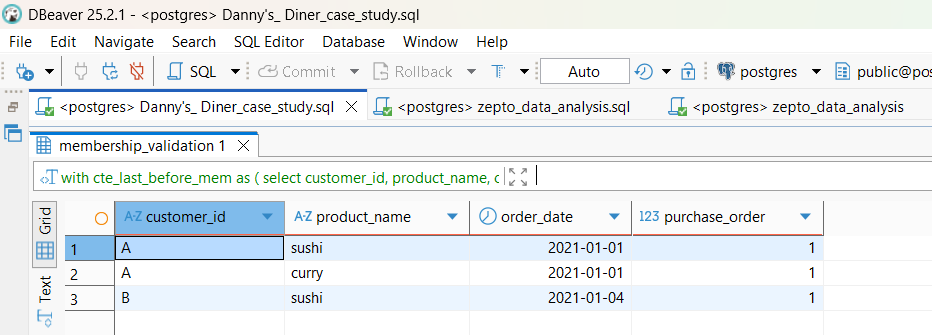
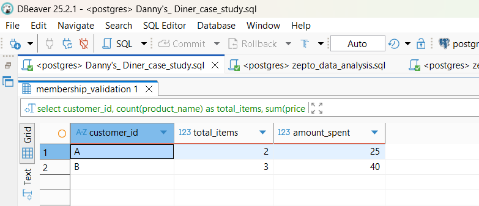
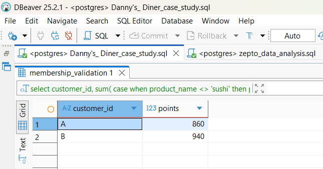
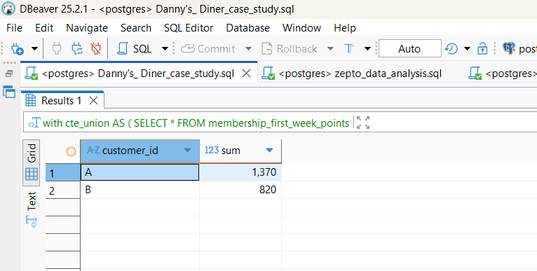

# 🍜 Danny's Diner — SQL Case Study


## 📌 Project Overview

This project is a SQL-based analysis of **Danny's Diner**, a restaurant customer analytics case study.

The objective is to analyse customer purchasing behaviour, restaurant visits, menu preferences, membership activity, and loyalty points.

Using SQL, I analysed the available transaction and membership data to answer **10 business questions** and generate actionable customer insights.

---

## 🎯 Business Objective

Danny wants to better understand his customers by analysing:

* 💰 Customer spending
* 📅 Customer visit frequency
* 🍣 Favourite menu items
* ⭐ Membership behaviour
* 🎁 Loyalty points
* 🛒 Purchasing patterns before and after membership

The analysis helps Danny understand his customers and potentially provide a more personalised experience.

---

## 🗃️ Database Schema

The analysis uses three tables:

### `sales`

Contains customer transaction information.

| Column        | Description         |
| ------------- | ------------------- |
| `customer_id` | Customer identifier |
| `order_date`  | Date of purchase    |
| `product_id`  | Purchased product   |

### `menu`

Contains restaurant menu information.

| Column         | Description        |
| -------------- | ------------------ |
| `product_id`   | Product identifier |
| `product_name` | Name of menu item  |
| `price`        | Item price         |

### `members`

Contains membership information.

| Column        | Description             |
| ------------- | ----------------------- |
| `customer_id` | Customer identifier     |
| `join_date`   | Membership joining date |

---

# 🛠️ SQL Skills Demonstrated

This project demonstrates the following SQL concepts:

* SELECT
* WHERE
* GROUP BY
* ORDER BY
* INNER JOIN
* LEFT JOIN
* Aggregate Functions
* COUNT()
* COUNT(DISTINCT)
* SUM()
* CASE WHEN
* Common Table Expressions (CTEs)
* RANK()
* ROW_NUMBER()
* Window Functions
* Date Filtering
* Date Arithmetic
* Customer-Level Analysis
* Loyalty Point Calculations

---

# 📊 Business Questions & Query Results

## Q1. What is the total amount each customer spent at the restaurant?

### 🔎 SQL Concept

`JOIN`, `SUM()`, `GROUP BY`

### 📸 Answer / Query Result



---

## Q2. How many days has each customer visited the restaurant?

### 🔎 SQL Concept

`COUNT(DISTINCT)`, `GROUP BY`

### 📸 Answer / Query Result



---

## Q3. What was the first item from the menu purchased by each customer?

### 🔎 SQL Concept

`CTE`, `ROW_NUMBER()`, Window Functions

### 📸 Answer / Query Result



---

## Q4. What is the most purchased item on the menu and how many times was it purchased?

### 🔎 SQL Concept

`JOIN`, `COUNT()`, `GROUP BY`, `ORDER BY`, `LIMIT`

### 📸 Answer / Query Result



---

## Q5. Which item was the most popular for each customer?

### 🔎 SQL Concept

`CTE`, `COUNT()`, `RANK()`, Window Functions

### 📸 Answer / Query Result



---

## Q6. Which item was purchased first by the customer after they became a member?

### 🔎 SQL Concept

`JOIN`, Date Filtering, `RANK()`, CTE

### 📸 Answer / Query Result



---

## Q7. Which item was purchased just before the customer became a member?

### 🔎 SQL Concept

Date Filtering, `RANK()`, CTE

### 📸 Answer / Query Result



---

## Q8. What is the total number of items and amount spent for each member before they became a member?

### 🔎 SQL Concept

`COUNT()`, `SUM()`, `JOIN`, Date Filtering, `GROUP BY`

### 📸 Answer / Query Result



---

## Q9. If each $1 spent earns 10 points and sushi has a 2x points multiplier, how many points would each customer have?

### 🔎 SQL Concept

`CASE WHEN`, `SUM()`, Conditional Logic

### 📸 Answer / Query Result



---

## Q10. How many points do customers A and B have at the end of January?

During the first week after joining the membership program, customers earn **2x points on all items**.

### 🔎 SQL Concept

* Date arithmetic
* `CASE WHEN`
* CTEs
* Aggregate functions
* Loyalty point calculation

### 📸 Answer / Query Result



---

# 💡 Key Business Insights

### 💰 Customer Spending

The analysis identifies differences in total spending between customers and highlights the highest-value customers.

### 🍜 Product Preferences

Ramen is the most frequently purchased menu item across the dataset.

### 👥 Customer Preferences

Each customer has different purchasing patterns, allowing Danny to better understand individual preferences.

### ⭐ Membership Behaviour

The analysis compares purchases before and after customers join the membership program.

### 🎁 Loyalty Program

The first-week membership bonus and sushi multiplier can significantly affect customer reward points.

---

# 📁 Repository Structure

```text
dannys-diner-sql-case-study/
│
├── README.md
│
├── SQL/
│   └── dannys_diner_case_study.sql
│
└── screenshots/
    ├── Q1_Total_Spent.png
    ├── Q2_Visit_Days.png
    ├── Q3_First_Item.png
    ├── Q4_Most_Purchased.png
    ├── Q5_Most_Popular.png
    ├── Q6_First_After_Membership.png
    ├── Q7_Before_Membership.png
    ├── Q8_Pre_Membership_Spending.png
    ├── Q9_Points.png
    └── Q10_January_Points.png
```

---

# ▶️ How to Run the Project

1. Download or clone this repository.
2. Open the SQL file.
3. Connect to your SQL database.
4. Run the table creation statements.
5. Insert the provided dataset.
6. Execute the queries for Q1–Q10.
7. Compare the results with the screenshots provided in this repository.

---

# 📚 Project Information

**Project:** Danny's Diner SQL Case Study

**Category:** Data Analytics / SQL

**Dataset:** Restaurant customer transactions

**Focus:** Customer Behaviour & Loyalty Analysis

---

# 🚀 Conclusion

This project demonstrates how SQL can be used to analyse transactional customer data and answer real-world business questions.

Through joins, aggregations, CTEs, window functions, conditional logic, and date analysis, the project provides insights into customer spending, visits, product preferences, membership behaviour, and loyalty rewards.

---

## 👨‍💻 Skills

**SQL | Data Analysis | Customer Analytics | Business Intelligence | Data Cleaning | Window Functions | CTEs**

